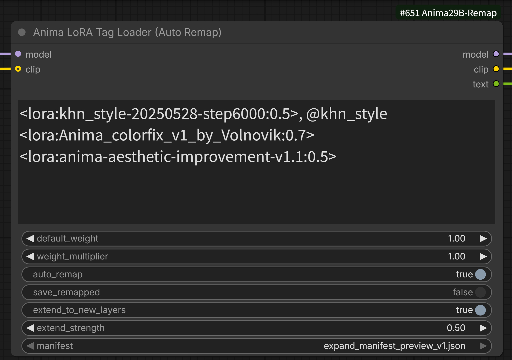
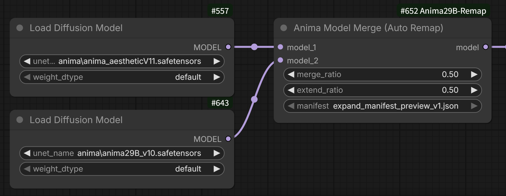
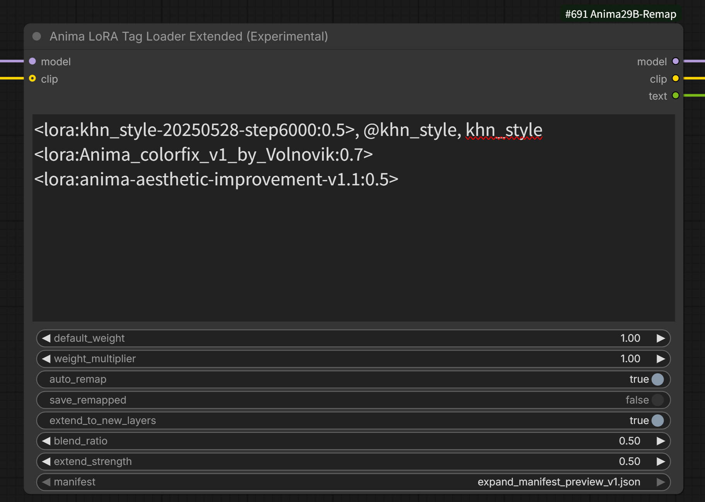
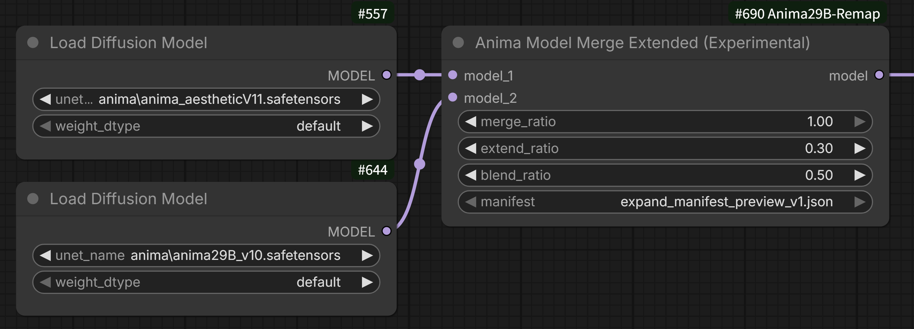

# ComfyUI-Anima29B-Remap

[English](README.md) | [日本語](README_ja.md)

Anima-2.9B(28層→40層のLLaMA Pro方式レイヤー拡張モデル)向けに、従来Anima(base, 28層)用のLoRA・モデルをレイヤー構造の違いを吸収した上で適用・マージするためのComfyUIカスタムノードパッケージです。

## これは何のためのツールか

Anima-2.9Bは、従来Anima(28層)の各層の間に新規12層を挿入する形で拡張されています(合計40層)。このため、従来Anima用に作られたLoRAやマージ用モデルをそのままAnima-2.9Bに適用すると、**層のインデックス(番号)がズレて全く別の層に誤って適用されてしまい**、崩れた画像(いわゆる「落書きレベル」の破綻)や、モデルマージ時のノイズ画像の原因になります。

本パッケージは、公式に配布されている`expand_manifest.json`(層拡張時のインデックス対応情報)を使って、このズレを自動検出・補正した上でLoRA適用やモデルマージを行います。

## フォルダ構成

```
ComfyUI-Anima29B-Remap/
├── LICENSE                                  # コードのライセンス(MIT)
├── README.md                                # 英語版README
├── README_ja.md                             # このファイル(日本語)
├── __init__.py                              # ノード登録
├── mapping/
│   └── expand_manifest_preview_v1.json      # 公式の層拡張マニフェスト(preview-v1用、出典は下記参照)
└── nodes/
    ├── __init__.py                          # (空、パッケージ化のため)
    ├── anima_common.py                      # 共通ロジック(層検出・マッピング計算)
    ├── lora_remap_anima.py                  # LoRAタグローダー(自動リマップ)
    ├── lora_remap_extended_anima.py         # LoRAタグローダー拡張版(実験的、前後ブレンド)
    ├── model_merge_anima.py                 # モデルマージ(自動リマップ)
    └── model_merge_extended_anima.py        # モデルマージ拡張版(実験的、前後ブレンド)
```

## インストール

このフォルダごと`ComfyUI/custom_nodes/`直下に配置し、ComfyUIを再起動してください。

```
ComfyUI/custom_nodes/ComfyUI-Anima29B-Remap/
```

またはgit cloneでも配置できます。

```
cd ComfyUI/custom_nodes/
git clone https://github.com/shin131002/ComfyUI-Anima29B-Remap.git
```

再起動後、ノード検索(ダブルクリック)で「Anima」と入力すると、以下のノードが見つかります。

- **Anima LoRA Tag Loader (Auto Remap)**
- **Anima Model Merge (Auto Remap)**
- **Anima LoRA Tag Loader Extended (Experimental)** — 実験的機能。詳細は後述
- **Anima Model Merge Extended (Experimental)** — 実験的機能。詳細は後述






---

## ノード1: Anima LoRA Tag Loader (Auto Remap)

`<lora:名前:重み>`というタグ構文をプロンプト文字列から解析してLoRAを適用する、LoRA Tag Power Loader系ノードと同じ使い勝手のローダーです。接続されたモデルが40層(Anima-2.9B系)で、かつ適用しようとしているLoRAが従来Anima(28層)用と判定された場合に、自動でキー名をリマップしてから適用します。

### 入力

| 名前 | 型 | 説明 |
|---|---|---|
| `model` | MODEL | LoRAを適用するモデル |
| `clip` | CLIP(任意) | LoRAを適用するCLIP |
| `text` | STRING | `<lora:名前:重み>`タグを含むプロンプト文字列 |
| `default_weight` | FLOAT | タグ内で重み省略時のデフォルト値 |
| `weight_multiplier` | FLOAT | 全LoRAの重みに一律で掛ける倍率 |
| `auto_remap` | BOOLEAN | ONで自動リマップ機構を有効化(デフォルトON) |
| `save_remapped` | BOOLEAN | ONで、その場でリマップを行った際に**変換後のLoRAをファイルとしてディスクに保存**する(デフォルトOFF、詳細・注意点は下記) |
| `extend_to_new_layers` | BOOLEAN | 【実験的機能】ONで、新規12層にもLoRAの効果を(近似的に)適用する(デフォルトOFF) |
| `extend_strength` | FLOAT | `extend_to_new_layers`使用時の、新規層への適用強度(タグの重みと掛け算で効く) |
| `manifest` | ドロップダウン | 使用する`expand_manifest.json`のバージョン選択 |

### 出力

| 名前 | 型 | 説明 |
|---|---|---|
| `model` | MODEL | LoRA適用後のモデル |
| `clip` | CLIP | LoRA適用後のCLIP |
| `text` | STRING | LoRAタグを取り除いた後のプロンプト文字列(後段のCLIP Text Encoderへ) |

### タグ構文

```
1girl, masterpiece <lora:my_old_anima_style:0.8> outdoors
```

`<lora:名前:model重み:clip重み>`のように、clip側の重みを別指定することも可能です(省略時はmodel重みと同じ値)。

### 自動判定のロジック(概要)

1. 接続された`model`の総ブロック数を検出(`net.blocks.N`キーの最大値+1、`llm_adapter.blocks`は判定対象から除外)
2. LoRAファイル自体が何ブロック分のキーを持つかを同様に検出
3. モデルの方がLoRAより層数が多い場合のみ、以降のリマップ処理に進む
4. モデルが28層(従来Anima)の場合は、リマップ機構全体(下記のキャッシュ確認も含む)を完全にスキップし、常に元のLoRAをそのまま適用する(誤って`_29Bremap`ファイルを28層モデルに適用してしまう事故を防止するための安全策)

### リマップ結果のキャッシュ保存(`save_remapped`)について

`save_remapped`は、**リマップ変換後のLoRAをファイルとしてディスクに保存するかどうか**を切り替えるトグルです。保存しておくことで、2回目以降の実行ではリマップ処理そのものをスキップし、保存済みファイルをそのまま読み込むだけで済むようになります。

> ⚠️ **注意: `extend_strength`や`extend_to_new_layers`を調整しながら検討している間は、`save_remapped`はOFFのままにしておくことを強くおすすめします。**
>
> キャッシュファイル(`_29Bremap`)が一度でも保存されると、**その後は`extend_to_new_layers`や`extend_strength`の値をいくら変更しても、新しい設定は一切反映されません**。既にキャッシュが存在する限り、そのファイルの中身(=保存した瞬間の設定で焼き付けられた結果)がそのまま優先して読み込まれ続けるためです。
>
> そのため、おすすめの運用は次の通りです。
>
> 1. まず`save_remapped`は**OFF**のまま、`extend_to_new_layers`や`extend_strength`をいろいろ試しながら好みの設定を探す(この間は毎回その場でリマップされるだけで、ファイルには保存されません)
> 2. 設定が決まったら、その時だけ`save_remapped`を**ON**にして1回実行し、確定版のキャッシュファイルを書き出す
> 3. 設定を変えて試し直したくなったら、生成された`_29Bremap`ファイルを一度削除してから、また1に戻る

動作の流れは以下の通りです(接続モデルが40層=Anima-2.9B系で、かつLoRAがリマップ対象と判定された場合のみ発生します)。

1. **まず`<元のLoRA名>_29Bremap.<拡張子>`という名前のファイルが、元LoRAと同じ検索方法(同フォルダ/サブフォルダ含む)で既に存在しないか確認する**
2. **存在する場合**: そのファイルをそのまま読み込んで適用する。リマップ処理自体は一切行わない(=`save_remapped`の設定に関わらず、既存のキャッシュファイルがあれば常にそれが優先される)
3. **存在しない場合**: 元のLoRAを読み込み、その場でキーをリマップして適用する。この時点で`save_remapped`がONなら、リマップ結果を`<元のLoRA名>_29Bremap.<拡張子>`として**元LoRAと同じフォルダに新規保存する**(既に他のタイミングで同名ファイルが作られていた場合は上書きせずスキップする)。`save_remapped`がOFFの場合は、適用はするがファイルへの保存は行わない(次回実行時もこの「その場でリマップ」処理を毎回繰り返すことになる)

つまり`save_remapped`をONにしておくと、初回実行時に自動生成された`_29Bremap`ファイルが以降ずっとキャッシュとして使われ続けるため、**2回目以降はリマップ処理のオーバーヘッドなしで高速に適用できる**、という仕組みです。

### 注意点

- `llm_adapter.blocks`(6層、拡張の対象外)は、メインの`net.blocks`(28→40層への拡張対象)とは別構造として扱われ、リマップ対象から除外されます
- LoRAのキー命名は「ドット区切り(`net.blocks.N.`)」「kohya形式のアンダースコア区切り(`..._blocks_N_...`)」の2パターンに対応しています。それ以外の命名規則の場合は検出されず、リマップなしでそのまま適用されます

---

## ノード2: Anima Model Merge (Auto Remap)

2つのAnimaモデル(MODEL)を、レイヤー構造の違いを自動吸収しながらマージします。

### 入力

| 名前 | 型 | 説明 |
|---|---|---|
| `model_1` | MODEL | マージ元モデル1(上側スロット) |
| `model_2` | MODEL | マージ元モデル2(下側スロット) |
| `merge_ratio` | FLOAT(0.0〜1.0) | `model_1`側の混合比率 |
| `extend_ratio` | FLOAT(0.0〜1.0) | 【実験的機能】新規12層にも、コピー元の旧層の値を(近似的に)ブレンドする度合い(デフォルト0.0 = 従来通り新規層は2.9B側のまま) |
| `manifest` | ドロップダウン | 使用する`expand_manifest.json`のバージョン選択 |

### 出力

| 名前 | 型 |
|---|---|
| `model` | MODEL |

### `merge_ratio`の意味

- `1.0` → 出力は`model_1`(上側)100%
- `0.0` → 出力は`model_2`(下側)100%
- `0.5` → 50:50でブレンド

### アーキテクチャに応じた自動切り替え

| 状況 | 出力 |
|---|---|
| 両方28層(従来Anima派生同士) | 28層のまま、直接マージ(リマップ不要) |
| 両方40層(Anima-2.9B派生同士) | 40層のまま、直接マージ(リマップ不要) |
| 片方が40層、片方が28層 | **常に40層で出力**。28層側の重みをリマップした上で、既存28層部分のみ`merge_ratio`でブレンド。新規12層(拡張層)は、`model_1`・`model_2`どちらのスロットに繋がれていても**デフォルトでは常に40層側モデルの値をそのまま使用**(`merge_ratio`の影響を受けない。`extend_ratio`で挙動を変更可能、詳細は下記) |

### `extend_ratio`について(新規12層への拡張、実験的機能)

デフォルト(`extend_ratio = 0.0`)では、新規12層は常に40層側モデル(Anima-2.9B系)の値をそのまま使用し、`merge_ratio`や28層側モデルの影響を一切受けません。

`extend_ratio`を0より大きくすると、`expand_manifest.json`の`inserted_to_source`(各新規層が初期化時にどの旧層からコピーされたか)を使い、新規層の値に28層側モデルの対応する旧層の値を(リマップした上で)ブレンドします。

```
新規層の最終的な値 = (1 - extend_ratio) × 2.9B側モデル自身の値 + extend_ratio × 28層側モデルの対応する旧層の値
```

`extend_ratio = 1.0`にすると、新規層についても28層側モデルの(近似的な)値で完全に置き換わります。LoRA側の`extend_to_new_layers`/`extend_strength`と同じ考え方に基づいていますが、こちらは独立した機能で、**「正解」は存在しない近似処理**である点は同様です。

なお、このノードには保存機能がないため(下記参照)、LoRA側の`save_remapped`のような「一度保存すると設定変更が反映されなくなる」という注意点はありません。マージ結果を保存する際は、その都度明示的に`ModelSave`ノードを実行する必要があるため、意図しない古い設定のファイルを使い続けてしまう心配は基本的にありません。

### バイパス時の挙動

ノードを「Bypass」モードにした場合、ComfyUI標準の挙動により、型が一致する最初の入力(`model_1`、上側)がそのまま出力されます。これは本ノード固有の実装ではなく、ComfyUI自体の標準機能によるものです。

### 保存について

このノード自体には保存機能はありません。マージ結果を保存する場合は、ComfyUI標準の**`ModelSave`**ノード(`advanced/model_merging`カテゴリ)を`model`出力に接続してください。

```
[Anima Model Merge] --MODEL--> [ModelSave]
```

`ModelSave`はUNet(拡散モデル)部分のみを保存します(CLIP/VAEは含まれません)。保存先はデフォルトで`ComfyUI/output`配下になるため、生成用に使う場合は`models/diffusion_models`等へ移動してください。

---

## ノード3・4: Extended (Experimental)版について

`Anima LoRA Tag Loader Extended (Experimental)`と`Anima Model Merge Extended (Experimental)`は、通常版のノード(ノード1・2)を一切変更せず、**別ファイル・別ノードとして追加した実験的なバリエーション**です。通常版はこれまで通りの動作のまま安心して使い続けられます。

### 何が拡張されているか

通常版の`extend_to_new_layers`/`extend_strength`(LoRA)や`extend_ratio`(モデルマージ)は、新規12層への適用時、`expand_manifest.json`の`inserted_to_source`が示す**「直前の旧層」のみ**を情報源としていました。

Extended版では、これを**「直前(前側)」と「直後(後ろ側)」の両方の旧層を、指定した比率でブレンドする**形に一般化しています。

- **LoRA Extended**: `blend_ratio`(0.0〜1.0)を追加。前側の重みが`blend_ratio`、後ろ側の重みが`1 - blend_ratio`
- **Model Merge Extended**: 同じく`blend_ratio`を追加。既存の`extend_ratio`と組み合わせて使います(`extend_ratio`が「2.9B自身の値」と「旧モデル由来のブレンド値」の混合比率、`blend_ratio`がその「旧モデル由来のブレンド値」自体を前後どちらの層から作るかの比率)

```
新規層への適用値 = 前側(直前の旧層)の値 × blend_ratio + 後側(直後の旧層)の値 × (1 - blend_ratio)
```

**`blend_ratio = 1.0`のとき、後側の寄与が0になるため、通常版(ノード1・2)と数値まで完全に同じ結果になります**(テスト済み)。`blend_ratio`を下げていくと、徐々に「直後の層」の影響が混ざっていきます。

### キャッシュファイルについて

LoRA Extended版のキャッシュファイルは、通常版と混同しないよう**別のサフィックス(`_29Bremap_ext`)**で保存されます。通常版のキャッシュ(`_29Bremap`)とは独立しているため、互いに上書きし合うことはありません。ただし、通常版と同様、`extend_to_new_layers`/`blend_ratio`/`extend_strength`を変更しながら検討する間は`save_remapped`をOFFのままにしておくことを推奨します(注意点は通常版と同じです)。

### 位置づけ

あくまで実験目的の追加ノードです。「新規層への適用方法をもう少し細かく制御したい」と感じた時に使うもので、通常版だけで十分な場合は無理に使う必要はありません。

---

## `expand_manifest.json`について

Anima-2.9B配布元(Hugging Face、[Gazingstars123/Anima-2.9B](https://huggingface.co/Gazingstars123/Anima-2.9B))で公式に公開されているファイルをそのまま同梱しています。28層から40層への拡張時に「どの位置に新規層を挿入したか」(`insertion_positions`)が記載されており、本パッケージはこの情報から、旧28層の各インデックスが新40層構造のどの位置に対応するかを計算しています。中身は挿入位置などの小さなメタデータのみで、モデルの重み自体は一切含まれません。

今後Anima-2.9Bが新バージョン(v1.1等)にアップデートされ、層構成が変わった場合は、該当バージョンの`expand_manifest.json`を`mapping/`フォルダに追加し、各ノードの`manifest`ドロップダウンから選択してください。

## 既知の制約

- 現時点でテスト済みなのはAnima-2.9B preview-v1構成(28→40層、挿入位置12箇所)のみです
- LoRAのキー命名規則が想定外のパターンの場合、自動検出に失敗しリマップされません
- モデルマージは`comfy.model_patcher.ModelPatcher`の`get_key_patches`/`add_patches`(ComfyUI標準のマージ機構と同じ仕組み)を利用しています

## ライセンスについて

Anima(base)およびAnima-2.9Bは、いずれも**CircleStone Labs Non-Commercial License**の下で提供されています。本パッケージ(LoRA Remap / Model Mergeノード)を使って生成される、リマップ後のLoRAファイルやマージ後のモデルファイルは、いずれもこのライセンスにおける「Derivative(派生物)」に該当するため、**同じ非商用制限が引き継がれます**。

- モデル本体・その派生物(今回のリマップ済みLoRA、マージ済みモデルを含む)は、非商用目的でのみ使用可能です
- 一方で、これらのモデルを使って**生成した画像(Outputs)自体は商用利用が可能**です(ライセンス上、生成画像は「Derivative」の定義から明示的に除外されています)
- Animaはさらに`Cosmos-Predict2-2B-Text2Image`の派生モデルにも該当するため、その範囲でNVIDIA Open Model License Agreementの条件も付随します
- ライセンス上、個人が「重みファイル(モデルやLoRA)そのもの」を有償配布すること自体は例外的に認められていますが(第2.c項)、それを組み込んだ製品・サービス・ツールとしての提供は対象外で、別途通常の商用ライセンスが必要です

本ツールは個人利用・非商用での使用を前提としています。商用利用や配布を検討する場合は、必ず一次情報である`LICENSE.md`(Hugging Face上のAnimaリポジトリに同梱)を確認するか、専門家に相談してください。本READMEの記載は法的助言ではありません。

なお、このライセンス制約は**Animaのモデル重み自体(および、それを使って作られたリマップ済みLoRA・マージ済みモデル)に適用されるもの**であり、本リポジトリの**コード自体(ノードのPython実装)はMITライセンス**(同梱の`LICENSE`ファイル参照)の下で公開しています。

## 免責事項とサポートポリシー

### 免責事項

- このノードは**技術サポートなし**で提供されます
- 機能の保証はありません
- 将来のComfyUIアップデートとの互換性は保証されません
- バグレポートや機能リクエストに対応しない場合があります
- 自己責任で使用してください

### サポート状況

- ❌ issueやメールでの個別サポートなし
- ❌ バグ修正や機能追加の保証なし
- ✅ コードはオープンソース - 自由にフォーク・修正可能
- ✅ コミュニティディスカッション歓迎(返答の約束なし)

### 問題の報告

サポートは保証されませんが、以下が可能です:
1. リポジトリの既存issueを確認
2. このREADMEとトラブルシューティングセクションを確認
3. issueを開く(対応されない場合があります)
4. 自分でフォークして修正

## ライセンス

MIT License - 自由に使用、変更、配布できます。

ただし前述の通り、Animaモデル自体(重み、およびそこから作られるLoRA・マージ済みモデル)は別途CircleStone Labs Non-Commercial Licenseの制約を受けます。
